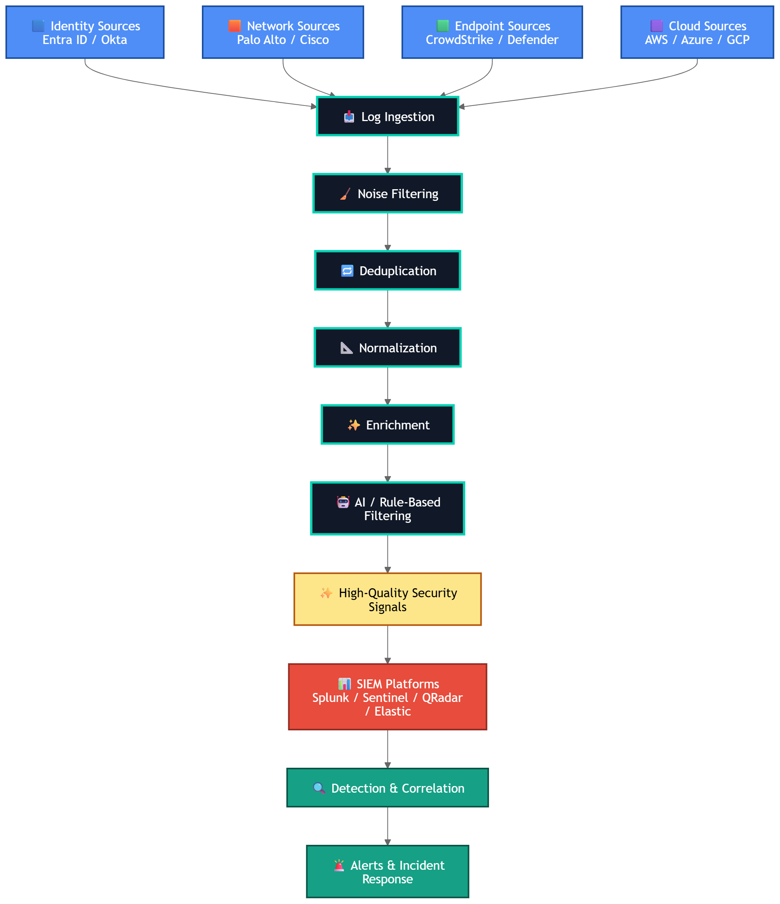

# Product Overview

Databahn is a security data pipeline and security data fabric platform that acts as a control layer between enterprise data sources and downstream security platforms such as SIEMs, data lakes, and analytics tools. It helps organizations collect, normalize, enrich, filter, and route security telemetry before it reaches security operations tools.

The platform is designed to address common SOC challenges such as excessive log volume, noisy alerts, high SIEM ingestion costs, inconsistent log formats, and limited visibility into telemetry pipelines. Instead of forwarding all raw logs directly to SIEM platforms, Databahn processes and optimizes telemetry to ensure that only meaningful and high-value security signals are forwarded for detection and investigation.

Databahn supports telemetry ingestion from multiple security and infrastructure sources, including:

* Identity platforms such as Microsoft Entra ID
* Network security devices such as Palo Alto Networks firewalls
* Endpoint detection and response (EDR) platforms such as CrowdStrike
* Cloud platforms and cloud-native services
* Customer applications and custom log sources
* Security tools, APIs, Syslog sources, and cloud storage pipelines

The platform enables organizations to improve detection quality, reduce operational noise, optimize storage and SIEM costs, and maintain better visibility into log collection and security telemetry pipelines.

## Key Capabilities

### Data Ingestion and Integration

* Supports ingestion of logs and telemetry from multiple data sources
* Supports integration with identity, network, endpoint, cloud, and application platforms
* Supports multiple ingestion methods such as Syslog, APIs, AWS S3/SQS, and cloud-native integrations
* Enables centralized telemetry collection across hybrid and multi-cloud environments

### Data Filtering and Noise Reduction

* Removes duplicate and redundant log events
* Applies rule-based and AI-driven filtering mechanisms
* Filters low-value or noisy telemetry before forwarding to SIEM platforms
* Reduces alert fatigue and unnecessary event processing

### Data Normalization and Enrichment

* Normalizes logs into standardized schemas and formats
* Enriches telemetry with contextual information such as IP intelligence, user context, geolocation, and threat indicators
* Improves consistency and searchability of security data across platforms

### SIEM and Platform Integration

* Supports integration with multiple SIEM and analytics platforms
* Routes optimized telemetry to downstream security tools and storage platforms
* Helps reduce SIEM ingestion and retention costs by forwarding only relevant data

### Pipeline Visibility and Monitoring

* Provides visibility into telemetry ingestion pipelines
* Detects missing, delayed, or inactive log sources
* Monitors ingestion health, data flow, and pipeline coverage
* Helps ensure continuous log availability for security monitoring and compliance

### Security Operations Optimization

* Improves signal-to-noise ratio for SOC teams
* Enhances detection engineering and threat hunting workflows
* Enables more efficient incident detection and investigation
* Supports scalable security data management across enterprise environments